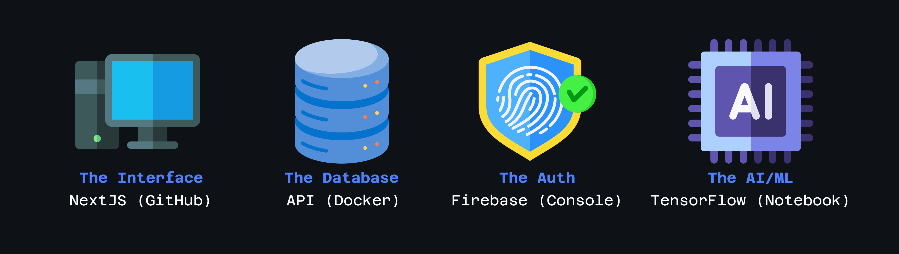

## 🔐 Monolith Password Manager Documentation

### 1. Introduction

#### Overview
Monolith is a password manager application and a complete user data leak prevention system developed for users who either want to self-host their password managers on their own infrastructures rather than giving the control over to a third party or for organizations or people who aren't as tech-savvy and want to take charge of their digital security and privacy. It allows users to securely store and manage their passwords. This documentation provides a guide on how to use the Monolith application.

You can watch an in-depth explanation of this project here:

https://github.com/NotSooShariff/Password-Manager/raw/main/public/explainer.mp4 

[](https://www.youtube.com/watch?v=Tbqcxu5fYGg)


#### Features
- User authentication using Firebase
- Docker container for database deployment
- Secure password storage
- Password generation
- Password retrieval
- Password management

#### Tech Stack
- NextJS
- TypeScript
- TailwindCSS
- Firebase
- Docker
- Snyk

### Components / Solution Infrastructure

These are the four components of our solution (and where to find them):



### 2. Getting Started

#### Prerequisites
Before you begin, ensure you have the following prerequisites installed:
- [Node.js & npm (Node Package Manager)](https://nodejs.org/en/download)
- [Git](https://git-scm.com/downloads)
- [Docker](https://docs.docker.com/desktop/install/windows-install/) 
- [Firebase account](https://console.firebase.google.com/)
- [Make](https://gnuwin32.sourceforge.net/packages/make.htm) (Optional) 
- A hosting provider (Optional)
  

#### Installation
1. Clone the Monolith repository from GitHub. Using the following command:
   ```
    git clone https://github.com/NotSooShariff/Password-Manager.git
   ```
2. Navigate to the project directory using the following commands:
   ```
    cd Password-Manager
    ```
3. Install dependencies using:
   ```
    npm install
    ```
4. Pull the database from docker:
   ```
    docker pull notsooshariff/mono-db
    ```

### 3. User Authentication

#### Firebase Setup
- Create a Firebase project at [Firebase Console](https://console.firebase.google.com/).
- Obtain Firebase API Keys (apiKey, authDomain, projectId, etc.).
- Use the `.env.template` to create a `.env.local` and paste all your API Keys there so that the app can access these variables locally. 
- Once you have set this up, you will be able to use Firebase OAUTH to log in to your Application.

### 4. Application Structure

#### Project Directory
-  The application follows a typical NextJS project's structure with the latest version 

## Getting Started

First, Get your database up and running:
```
 docker run -d --name my-mongodb-container -p 5000:5000 notsooshariff/mono-db
```

Once your database is running and your Firebase keys have been configured, run the development server:

```bash
npm run dev
# or
yarn dev
# or
pnpm dev
# or
bun dev
```

Open [http://localhost:3000](http://localhost:3000) with your browser to see the website live.

